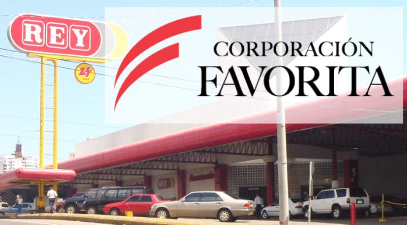
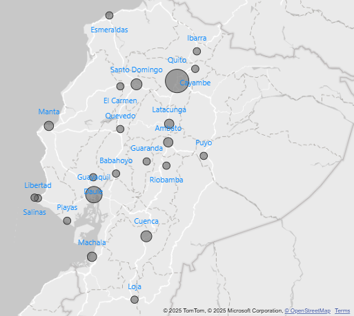
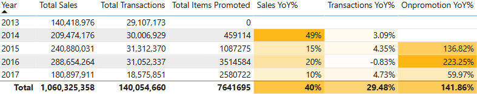
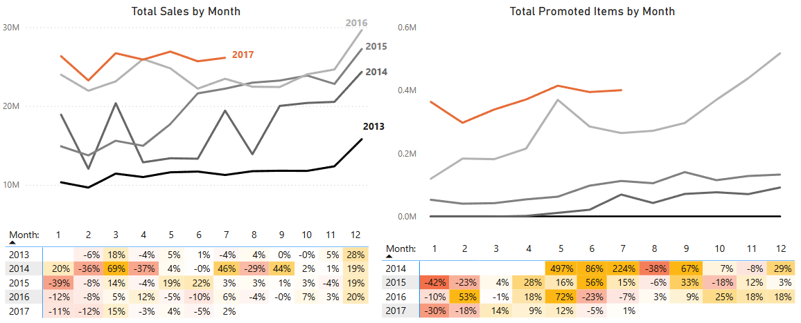
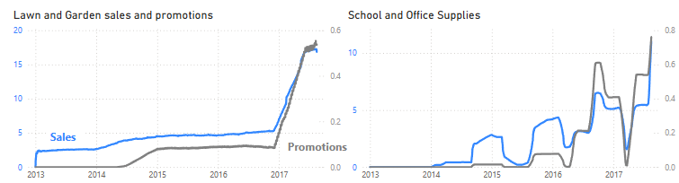
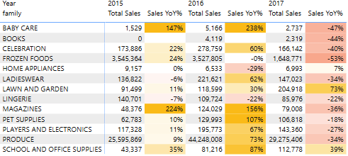
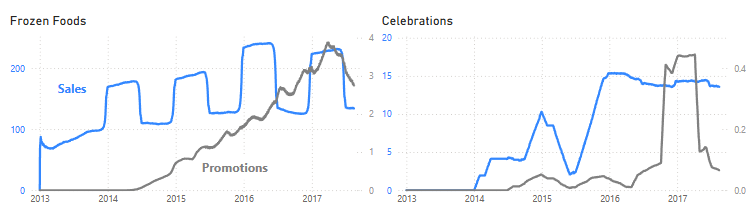
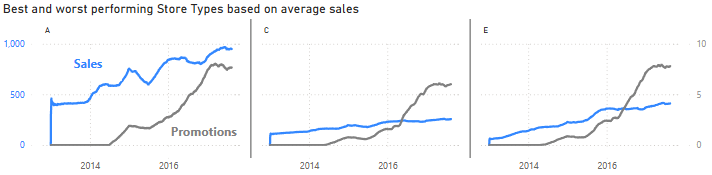
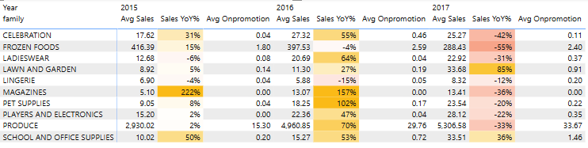
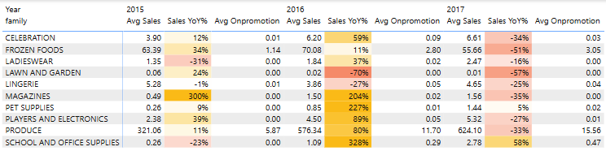

# Corporacion Favorita Sales Analysis from 2013 to 2017

## Table of Contents

- [Background](#background)
- [Executive Summary](#executive-summary)
- [Data Structure](#data-structure)
- [Insights Deep Dive](#insights-deep-dive)
- [Recommendations](#recommendations)
- [Clarifying Questions, Assumptions, and Caveats](#clarifying-questions-assumptions-and-caveats)

## Background

[Corporación Favorita](https://www.corporacionfavorita.com/) is a large grocery retailer based in Ecuador. We offer a variety of products from Automotive to Seafood at locations across the company. After April 2014, product promotions were implemented that coincided with an increase in the already upward sales trend. In light of this, our analysis has explored the extent to which current promotional efforts have been successful in keeping this upward trend. Across these product families, as well as different store types and clusters, I aim to analyze the overall sales trends and the effectiveness of promotions at Favorita.

More specifically, in this report I will look into the key performance indicators of growth rate (i.e., year-over-year and month-over-month percentage increases) and overall averages for sales, diced by product family and store types.

These insights will be sent to the sales and marketing teams to inform future promotional efforts for specific kinds of products at specific stores, and to better allocate marketing and product promotions. These insights will also be delivered to the operations and the product manager.

## Executive Summary

Corporación Favorita has averaged 215k in yearly sales and is growing at a rate of 24% annually. The number of total items promoted is likewise increasing by an average annual rate of 140%. Grocery I contributes the most in total average sales are (3,770 units). On the other hand, books have had the worst growth rate at -44% so far in 2017 and always trending negatively throughout the years. Lawn and Garden and School and Office Supplies products have the strongest relationship between average sales and promotions. Stores in the category of Type A have by far the **highest** average sales per store (742 units compared to the next highest, Type B, with 463). Type C has by far the **lowest** average sales per store (256 units), despite being the store type with the second-highest number of total stores (15). Comparing both stores, Type C stores do not promote high-growth products nor non-popular products. Favorita might benefit from a) Type A stores devoting more resources to drastically increasing promotional efforts, b) dropping books from our product lines, and c) strategic timing of promotions for seasonal items.

## Data Structure

- For the `train` table, each row represents the number of units of a product sold (`sales`) and total number of items for promotion (`onpromotion`) for a specific store (`store_nbr`) and type of product sold (`family`) on a given day. `family` is repeated for each `store_nbr` such that each day has all combinations of both.
- For the `stores` table, each row represents a store identified by `store_nbr` with its city and province (`state`) as well as its group in the `type` and `cluster` columns.
- Each row of the `transactions` table represents the number of transactions on a given day for a given store.

_See `eda.ipynb` file for more information about each variable and in-depth detail on each table._

## Insights Deep Dive

### Sales Trends and Growth Rates

- Corporación Favorita averages 215k in sales and is increasing every year with a growth rate of 24% annually.
- Sales surge by an average of 22% in November where they peak in December, then drop into the next year until February where they either remain stable or slightly rise until November. This shows seasonality.
- The most dramatic increase in sales was from 2013 to 2014, which seems to be associated with the introduction of promoted items around May 2014, particularly the huge increase (224%) of promoted items in July 2014.
- The number of total items promoted, similar to sales, is also increasing every year and has an average annual growth rate of 140%.

### Key Product Family Performance

- The family with the highest growth so far in 2017 has been Lawn and Garden (73%).
- The top 10 highest product families in total average sales are:
  - Grocery I (3,770 units)
  - Beverages (2,390 units)
  - Produce (1,350 units)
  - Cleaning (1,070 units)
  - Dairy (710 units)
  - Bread/Bakery (460 units)
  - Poultry (350 units)
  - Meats (340 units)
  - Personal Care (270 units)
  - Deli (265 units)
- Although the lowest growth rates so far are Frozen Foods (-53%) and Baby Care (-47%), Frozen Foods has enormous growth in December on average (~400%), so this may be expected. This is similar to Baby Care (~81% in December).
- The product families that have the strongest relationship between sales and promotions are Lawn and Garden and School and Office Supplies, with the latter centering around start of school.

### Poor Product Family Performers

- Although only started in 2016, books have been on a strong decline at a rate of -44% so far in 2017.
- Last year, the lowest growth rates were Home appliances (-29%) and Lingerie (-22%), both of which have consistently been low across the years.
- However, Home Appliances currently have the third highest growth rate so far just halfway into the year (7%).
- Similarly, there is a slight negative trend in Lingerie sales that seems to be offset by the introduction of more promotions starting November 2016.

- There were instances where promotions had no relationship with sales, shown especially with Frozen Foods and Celebrations:

### Sales by Store Types and Clusters: contributors for success

- Stores of Type A have the highest sales by far per store (742 units compared to the next highest, Type B with 463 average in sales). This is because:
  - Type A consists of the two highest-performing clusters (5 and 11)
  - The other two clusters, 14 and 17, are performing satisfactorily
- Type C has by far the lowest average sales per store (256 units), despite being the store type with the second-highest number of total stores (15).
  - Three out of four of Type C's clusters (15, 3, & 7) do not go above 300 in average sales. Cluster 12 is below 500 in average sales.
  - Even Type E stores, with by far the lowest number of total stores (4), has better average sales (412 units). We compare E, C, and A in the below graph.

- Looking deeper into what contributes to the highest-performing store type A:
  - Lawn and Garden currently has the highest growth rate (85%) and has the third-highest contribution.
  - Produce and Frozen Foods contribute to the most to sales.
- Compare this to the worst-performing store type C:
  - There are 0 promoted Lawn and Garden items and average sales are virtually at 0, missing out on the highest growing product family.
  - Besides the most popular families (Produce and Frozen Foods), there are less than 7 average sales for every other category.
  - Besides three of the highest sales contributors: Produce, Frozen Foods, and School and Office Supplies, there are virtually 0 promoted items on average

**Store Type A, the highest in sales:**

**Store Type C, the lowest in sales:**

## Recommendations

 

<u>**Optimize Product Promotions**</u>

- **Focused promotion:**
  - Continue to promote Lawn and Garden and School and Office Supplies products due to their strong relationship with promotions
  - Strategically time promotions:
    - Office and School Supplies prior to and during school season
    - Seasonal items like in-season Produce
- **Discontinue products:** Consider removing books from our product listing due to very poor sales trend.
- **Continue to monitor:** Monitor Baby Care, Lingerie, and Home Appliances product families to see if the trend continues upward. Possibly consider experimenting without promotions to see the how effective promotions are for these volatile products.

 

<u>**Growth Strategies For Poor-Performing Stores**</u>

- **Increase promotional opportunities:** For stores of Type C, the worst in average sales, focus much more efforts on promoting:
  - more products in general, other than those already being promoted (i.e., Produce and Frozen foods)
  - Lawn and Garden items, which have seen massive growth in every other store Type but are not being capitalized on here (i.e., no promotions on average).
- **Model high-performing stores:** For stores of Type A;
  - continue current promotional patterns, especially in high-performing items (i.e., Lawn and Garden, Produce, and Frozen Foods)
  - monitor these products to see if their positive trend continues

 

## Clarifying Questions, Assumptions, and Caveats

### Clarifying Questions

- Are the specific sales units across stores consistent?
- Do certain stores experience lapses in recording sales, transactions, and promotions? (See below for specific stores, clusters, and types)
- What do clusters and types represent? There seems to be no geographical correlation I can find.
- What are entailed in product promotions specifically, e.g., discounts, advertising? This would be useful to analyze the profitability impact of promotions.
- Why do transactions and sales not line up? For instance, transactions accounts for two extra days of the year compared to sales.

### Assumptions

Changelog:

- correct city's incorrect state: Libertad is in Santa Elena, not Guayas
- created the `stores_geography` and the `dates` tables for compatibility with geographical and date information
- make `cluster` a pandas object, not a numeric

### Caveats

- This is not a causal analysis; any relationships discussed in this report cannot be implied to explain the causes of sales, even if, for example, the correlation between promotions and sales for a specific product category is very high.
- We do not have access to data on important datapoints like revenue, profit, and pricing of product families.
  - For example, high Beverage sales may generate the same revenue as Grocery II products despite Grocery II performing much more poorly in sales; however, since sales is in units, the average price of a Grocery II product might just be significantly greater.
- Missing sales, promotional, & transaction data from the following store during certain periods:
  - Cluster 16 consisting of Store Number 18, from September to November 2016
  - The `state` of Chimborazo consisting of Store Number 14 from city Riobamba, from early August to early September 2014
  - The state of Pastaza consisting of Store Number 22, does not have data until mid-early October 2015
  - the city Salinas, does not have data from from end of August to end of October 2016
- There were unusual spikes in number of products promoted/sold on certain days--possibility for incorrect data
  - Cluster 13 had an unusual spike in sales and promotions in May 2016
  - The state Mananabi had unusual spike in promotions (only) from end of April to early November 2016 and a spike that stays up after the end of April 2017
  - the city Playas and had spikes in sales from about 12/9/2014, 12/14/2015, 12/12/2016, and spikes in promotions on about 3/29/2017, 4/29/2017, about 5/25/2017, and 7/26/2017
  - the city Ibarra had spike in sales 8/10/2013 and 0 promotions on 2/7/2017
